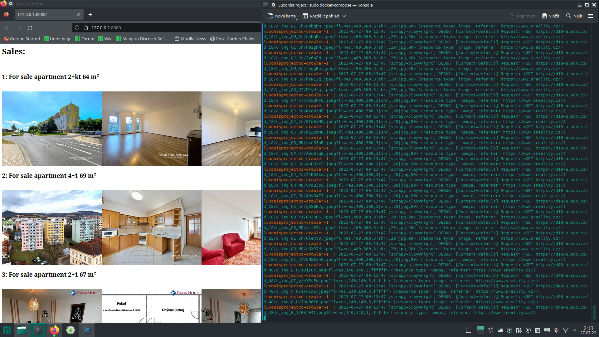

# Luxonis - Docker project
usage:
docker-compose up

##  Docker Structure
The docker-compose creates 4 Docker containers:
  - a very basic PostgreSQL image container
 -- has a custom healthcheck to ensures the DB is ready for use
 - a basic SQL Adminer image for visual view of the DB
 -- host: db
 -- username: username_test
 -- password: password_test
 -- DB name: SREALITY
 -- table name: sales
 - a Crawler  container
 -- installs scrapy and scrapy-playwright
 -- parses the sreality.cz webpage and fills the DB with data
 - a Flask WEB server:
 -- tries to get data from the DB on HTTP request
 -- responds with the parsed data OR with an error line
Start of other containers depend on DB's healtcheck becoming green.
## Notes:
Data in the DB are stored like this:
- id - serial integer - just ID
- title - Text - Text extracted from the **Title** div in SReality page
- image_urls - comma-separated list of URLs of all initially-loaded images for each sale offer

Docker healthcheck had to be implemented in order to ensure Scrapy wouldn't crash trying to write into non-ready DB

For the WebServer I decided to use Flask, as it allowed me to grant me the required functionality while requiring the least number of lines of my code. Creating new DBconnection every time it receives a HTTP request maybe is not the most efficient solution, but good enough for this showcase. For each sale offer it responds with h2 header of the Title content and images with all the scraped urls - first loading of the page might be slow-ish.

The SReality webpage wouldn't provide me with more than 16 pages worth of content at a time. I solved this by adding the Scrapy spider parameters of pages to crawl and running it multiple times. Since no specific ordering was required, the offers are solved by some internal SReality default order for now.

